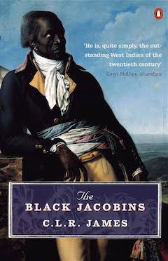

Body starts here

<!--
 -->

 A history of the Haitian revolution

- The author wears his allegiance on his sleeve, he is a marxist and presents a marxist interpretation on things.

- If you are not familar with the geography of the island it can be a little hard to follow the details of the military campaign, there is no provided map.
- Need to be familair with the french revolution, it cuts back to the political situation on france

Nonfiction Book Review Template:

Opening statement: Include title and author.

What does the book promise to deliver to the reader? Another way to look at it is, what problem does this book promise to solve?

Does it accomplish what it sets out to accomplish?

If so, how?

If not, what could the author have done differently?

What makes this author uniquely qualified to write on this topic?

What is the tone of the book? Is it humorous and easy to relate to, or is it more dry and academic?

Overall impression: This is where you give your personal take on the book.

Suggested points to include:

Was the book written in a way that you as a reader could easily relate to?

What was your favorite part of the book?

Do you have a least favorite part of the book?

If you could change something, what would it be?

Are there photos or illustrations? If so, are they effective in enhancing the book’s message?

Would you recommend this book